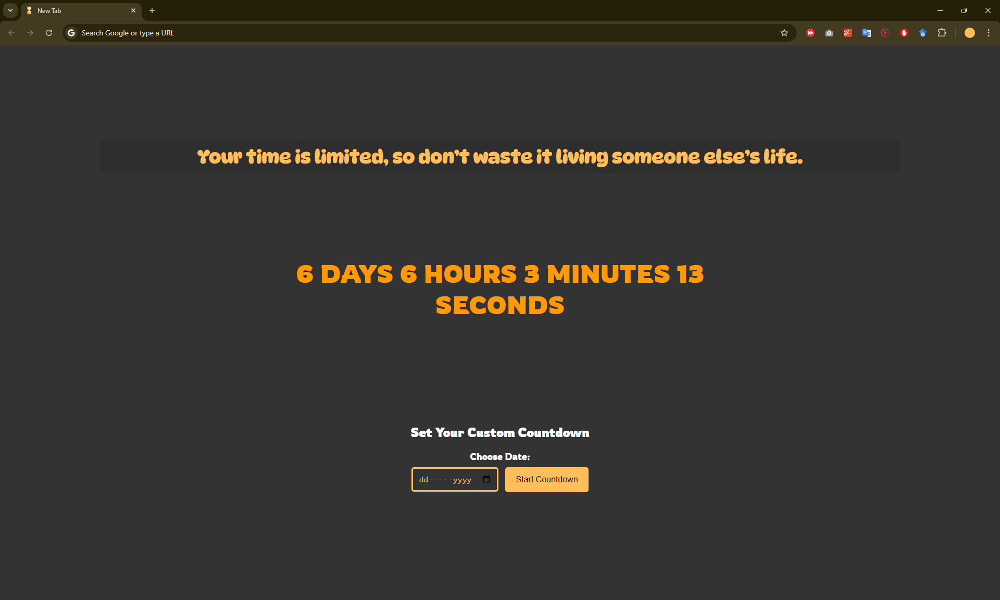

# ⏳ Countdown Timer Chrome Extension
This Chrome extension displays a dynamic countdown timer in every new tab. The extension allows users to set a countdown for a specific event, or track the remaining time.

## Features ✨
- *__Lifespan Countdown:__* Set a countdown for an event or specific deadline.
- *__Goal Deadline:__* Track the time remaining for important goals or projects.
- *__Random Motivational Quotes:__* Each time a new tab is opened, a random quote is displayed to inspire productivity and time management.
- *__Local Storage Support:__* The extension saves the timer state, so it continues from where it left off even after the browser is closed.<br>


## 📌 How it Works 
- When a new tab is opened, the countdown timer displays the remaining time based on the event set.
- A random motivational quote is displayed in the center, above the timer.
- Users can set a specific date for the countdown via the input option.

## Getting Started
### Installation 📥
1. Clone this repository to your local machine:
```bash
git clone https://github.com/abdullahkalim21/countdown-chrome-extention.git
```
2. Open Chrome and navigate to `chrome://extensions/`.
3. Enable Developer mode (toggle it on in the upper right corner).
4. Click on `Load unpacked` and select the directory where you cloned the repository.
5. The extension is now installed and will display the countdown timer in each new tab.

## Customization 🪄
### Add Your Own Quotes
- To add your own quotes, navigate to the `script.js` file and update the quotes array with your custom quotes:
```javascript
    const quotes = [
        "Time is precious, use it wisely.",
        "You may delay, but time will not.",
        "Do not squander time, for that is the stuff life is made of.",
        // Add more quotes here
    ];
```

## Contributing 💡
Contributions are welcome! Feel free to submit a pull request or open an issue if you have suggestions for improvements.

### Steps to Contribute:
1. Fork the repository.
2. Create a new branch `git checkout -b feature-branch`.
3. Make your changes.
4. Commit your changes `git commit -m 'Add new feature'`.
5. Push to the branch `git push origin feature-branch`.
6. Open a pull request.

## Contact 🤝
For any inquiries or suggestions, feel free to reach out:

__LinkedIn:__ [@ABDULLAHKALIM216](https://www.linkedin.com/in/abdullahkalim216) <br>
__GitHub:__ [@ABDULLAHKALIM21](https://github.com/abdullahkalim21)